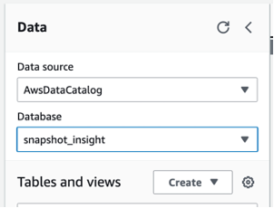

# Gather organization-wide Amazon RDS orphan snapshot insights using AWS Step Functions and Amazon QuickSight

AWS customers use [Amazon Relational Database Service (Amazon RDS)](https://aws.amazon.com/rds/) snapshots to back up data securely. You can create snapshots manually before maintenance and patching events as a precaution, even with automated snapshot creation enabled. When an RDS instance or cluster is deleted, the manual snapshots remain in the account and are counted towards the total backup size. Snapshots that are no longer referenced to deleted RDS instances or clusters are called *orphaned snapshots*. In a [previous post](https://aws.amazon.com/blogs/database/programmatic-approach-to-optimize-the-cost-of-amazon-rds-snapshots/), we discussed a programmatic approach to identify RDS orphan snapshots leveraging [AWS Command Line Interface (AWS CLI)](https://aws.amazon.com/cli/). We also discussed approaches to identify the oldest RDS snapshot of an instance and the RDS instance with the largest number of active snapshots. However, if you have multiple linked accounts, you need to search through each individual account to identify manual snapshots without an associated RDS instance or cluster, resulting in an operational burden.

In this post, we walk you through a solution to aggregate RDS orphan snapshots across accounts and AWS Regions, enabling automation and organization-wide visibility to optimize cloud spend based on data-driven insights. Cross-region copied snapshots, Aurora cluster copied snapshots and shared snapshots are out of scope for this solution.

## Solution overview

The solution uses [AWS Step Functions](https://aws.amazon.com/step-functions/) orchestration together with [AWS Lambda](https://aws.amazon.com/lambda/) functions to generate orphan snapshot metadata across your organization. Generated metadata information is stored in [Amazon Simple Storage Service (Amazon S3)](https://aws.amazon.com/s3/) and transformed into an [Amazon Athena](https://aws.amazon.com/athena/) table by [AWS Glue](https://aws.amazon.com/glue/). [Amazon QuickSight](https://aws.amazon.com/quicksight/) uses the Athena table to generate orphan snapshot insights.

The following diagram illustrates the solution architecture and workflow.


The workflow steps are as follows:

1. [Amazon EventBridge Scheduler](https://docs.aws.amazon.com/scheduler/latest/UserGuide/what-is-scheduler.html) invokes Step Functions on a configurable schedule to retrieve orphaned snapshot data. When the Step Functions state machine runs, the system cleans up previous logs and metadata to generate recent information so you can visualize your current standing in terms of snapshot usage. Step Functions contain two loops (namely Map states) to identify orphan snapshots across all accounts or current accounts for user-defined Regions based on your deployment preference, such as  `ORGANIZATION` or `CURRENT_ACCOUNT`.
2. [AWS Graviton](https://aws.amazon.com/ec2/graviton/) powered Lambda functions run concurrently to generate metadata for the orphaned RDS instance and cluster snapshots. The AWS Graviton runtime is used to gain better price-performance. You can change the Lambda runtime if you prefer a non-AWS Graviton Lambda architecture.
3. A snapshot JSON metadata file is pushed to a raw S3 bucket.
4. An AWS Glue crawler runs to capture new raw data and creates two raw data tables for the RDS instance and cluster snapshots.
5. As a cleanup activity, a Lambda function transfers the historical data file created during the previous Step Functions run to create an archive data store.
6. An S3 bucket stores the file historical data.
7. AWS Glue extract, transform, and load (ETL) jobs convert the nested JSON raw data to structured SQL query-friendly Parquet format.
8. The S3 bucket captures the metadata of the orphaned snapshots.
9. Two different AWS Glue crawlers for the archived and formatted data run to catalog the data in Athena. Two tables (`rds_ins` and `rds_cls`) store the metadata of orphaned snapshots.
10. QuickSight ingests the archived and formatted data to generate visual insights.

The following screenshots show how the QuickSight dashboard implemented in this solution provides orphan snapshot insights.

The first screenshot illustrates insights on an RDS instance orphan snapshot.

 

The following screenshot illustrates insights on an RDS cluster orphan snapshot.


During the monitoring account deployment step, you need to set the deployment type parameter in the `Config.toml` file, which gets stored in [Parameter Store](https://docs.aws.amazon.com/systems-manager/latest/userguide/systems-manager-parameter-store.html), a capability of [AWS Systems Manager](https://aws.amazon.com/systems-manager/). The workflow uses this parameter store value to initiates the loop, namely Map state.

If the deployment type is set for the whole organization, then the Map state iterates across all accounts. Otherwise, the Map state only runs for the current account. The workflow differs between the two deployments, as highlighted in the following state machine representation.

 

The solution consists of three deployments using [AWS CloudFormation](https://aws.amazon.com/cloudformation/) stacks:

* Monitoring account deployment (Steps 1–2 detailed in this post)
* Management account deployment (Steps 3–4)
* (Optional) Post-solution deployment (Steps 5–7)

For organization-wide visibility of orphan snapshots, run the monitoring and management account deployment steps and post-deployment steps. If you don’t have access to a management (payer) account, this solution is flexible enough to provide the visibility of orphan snapshots within a single account as well. In this case, just follow the monitoring account deployment steps and post-deployment steps.

Moreover, the monitoring and management account deployments generate insights on the QuickSight dashboard, but the QuickSight deployment is optional. You can skip the dashboard deployment by not providing a QuickSight user name (parameter: `quicksight_user_name`) in the `Config.toml` file. You can skip the QuickSight deployment if you are deploying the stack outside the [Regions supported by QuickSight](https://docs.aws.amazon.com/quicksight/latest/user/regions.html).

To implement the solution, complete the following steps:

1. Initialize your monitoring account environment.
2. Configure and deploy the monitoring stack.
3. Initialize your management account environment.
4. Configure and deploy the management stack.
5. Modify the EventBridge schedule.
6. Query Athena tables.
7. Implement QuickSight data read permission.

## Prerequisites

An [AWS Organizations ID](https://aws.amazon.com/organizations/) (`OU_ID`) is required when using the organization deployment type. For more details on how to create an organization and move accounts to an organization unit (OU), refer to [Creating an organization](https://docs.aws.amazon.com/organizations/latest/userguide/orgs_manage_org_create.html) and [Moving accounts to an OU or between the root and OUs.](https://docs.aws.amazon.com/organizations/latest/userguide/move_account_to_ou.html).

If you want the dashboard deployment, make sure QuickSight Enterprise Edition is activated, and [add SPICE capacity](https://docs.aws.amazon.com/quicksight/latest/user/managing-spice-capacity.html#spice-capacity-purchasing) at the Region where you are deploying the stack, if you don’t have it. You must have `quicksight:DescribeAccountSettings` permission to get the QuickSight identity Region.

## Initialize your monitoring account environment

Complete the following steps to set up your monitoring account environment:

1. Launch [AWS CloudShell](https://aws.amazon.com/cloudshell/) in the Region you want deploy the stack or your local shell.
2. Install Python 3. This deployment has been tested with Python version 3.10.6.
3. Run the following command to upgrade Python packages and initialize your monitoring account environment. This deployment has been tested with the boto3=1.34.23, botocore=1.34.23, and toml=0.10.2 versions. For information about retrieving the access keys referenced in the following code, refer to [Managing access keys (console)](https://docs.aws.amazon.com/IAM/latest/UserGuide/id_credentials_access-keys.html#Using_CreateAccessKey).

```
python3 -m ensurepip --upgrade
pip3 install botcore boto3 toml --upgrade

export AWS_ACCESS_KEY_ID=<YOUR_AWS_ACCESS_KEY for monitoring account>
export AWS_SECRET_ACCESS_KEY=<YOUR_AWS_SECRET_KEY for monitoring account>
export AWS_SESSION_TOKEN=<YOUR_AWS_SESSION_TOKEN for monitoring account>
export AWS_DEFAULT_REGION=<YOUR_AWS_PRIMARY_REGION for your Organization>

git clone https://github.com/aws-samples/rds-snapshot-inventory.git rds-snapshot-inventory
cd rds-snapshot-inventory
```

4. Run the following command to build and package the code artifact:

```
python3 build_artifact.py
```

## Configure and deploy the monitoring stack

Complete the following steps to set up the monitoring stack:

1. Locate the **Configuration for Monitoring Stack** section in `Config.toml` under the `rds-snapshot-inventory` directory.
2. Update the parameter values as instructed in the file comments.
3. Run the following command from the `rds-snapshot-inventory` directory:

```
python3 monitor_stack.py
```

4. Enter `Create` followed by `y` for stack creation when prompted.
5. Navigate to the AWS CloudFormation console and wait until the source code stack and main stack creation are complete before proceeding to the next step.

When it’s complete, the stack shows the status **CREATE_COMPLETE.**

6. Copy the value of `S3BucketRawArn` and `StepFunctionsSnapshotInsightRole` from the **Outputs** tab of the main stack required for management account deployment.

 

## Initialize your management account environment

Complete the following steps to set up your management account environment:

1. Launch CloudShell in the same Region where you deployed the monitoring stack or your local shell.
2. Run the following command to initialize your management account environment:

```
export AWS_ACCESS_KEY_ID=<YOUR_AWS_ACCESS_KEY for management account>
export AWS_SECRET_ACCESS_KEY=<YOUR_AWS_SECRET_KEY for management account>
export AWS_SESSION_TOKEN=<YOUR_AWS_SESSION_TOKEN for management account>
export AWS_DEFAULT_REGION=<YOUR_AWS_PRIMARY_REGION for your Organization>
```

3. Run the following command to clone, build, and package the code artifact if you are using CloudShell:

```
git clone https://github.com/aws-samples/rds-snapshot-inventory.git rds-snapshot-inventory
cd rds-snapshot-inventory 
python3 build_artifact.py
```

## Configure and deploy the management stack

Complete the following steps to set up the management stack:

1. Locate the **Configuration for Management Stack** section in `Config.toml` under the `rds-snapshot-inventory` directory.
2. Update the parameter values as instructed in the file comments.
3. Leave other parameters that you modified during monitoring account deployment unchanged.
4. Make sure that the management stack is deployed in the same Region as the monitoring account deployment. Check the `primary_region` parameter in the `Config.toml` file and update the `AWS_DEFAULT_REGION` environment variable if there is a mismatch. `OU_ID` is required for management stack deployment.
5. Run the following command from the `rds-snapshot-inventory` directory:

```
python3 management_stack.py
```

6. Enter `Create` followed by `y` for stack creation when prompted.
7. Navigate to the AWS CloudFormation console to verify that both the source code stack and main stack are complete.

When it’s complete, the stack shows as **CREATE_COMPLETE.**

## Modify the EventBridge schedule

You can optionally modify the EventBridge schedule that invokes the Step Functions workflow. The predefined weekly schedule is configured to run one time every Saturday to optimize cost, but you can edit it to suit your requirements.

 

You can also manually invoke the workflow immediately after deployment as a one-time activity to generate insights, rather than waiting for the predefined weekly EventBridge schedule. To do so, navigate to the Step Functions console and run the state machine.

## Query Athena tables

To query athena tables for orphan snapshots, complete the following steps:

1. On the Athena console, choose **Query editor** in the navigation pane

 

2. For **Data source**, choose `AwsDataCatalog` and for **Database**, choose `snapshot_insight`. 

 

3. To gather RDS instance orphan snapshot details, run the following query:

```
select * from rds_ins
```

4. To gather RDS cluster orphan snapshot details, run the following query:

```
select * from rds_cls
```

## Implement QuickSight data read permissions

To set up QuickSight, complete the following steps:

1. On the QuickSight console, choose the user icon and **Manage QuickSight.**
 

2. Choose **Security and permissions** in the navigation pane.
3. Under **QuickSight access to AWS services**, choose **Manage**.


 

4. Select **Amazon Athena** and **Amazon S3**.
5. Under **S3**, select three unattached snapshot metadata buckets (such as `snapshot-insight-<metadata_type>-<account_id>-<region>`) as well as an Athena query results bucket (such as `aws-athena-query-results-aor-<account_id>-<region>`). 
6. Select the write permission for the Athena workgroup for all four buckets. 

If you don’t see these buckets, check if they have successfully been created by the monitoring account CloudFormation stack.

7. Choose **Finish**.

 

8. Choose **Datasets** in the navigation pane and select each dataset.

 

9. [Create schedule refreshes](https://docs.aws.amazon.com/quicksight/latest/user/refreshing-imported-data.html#schedule-data-refresh) for the six datasets created during this deployment.

Choose refresh times with a gap of a few hours between EventBridge schedules. This allows the Step Functions workflow to generate unattached snapshot metadata on a staggered cadence, providing the most up-to-date outputs in the dashboard.

10.	Choose **Save**.

 

## Clean up
When you no longer need this solution, complete the following steps to delete the AWS resources and orphan snapshot metadata, to avoid ongoing charges to your account:

1. Run the following command from the monitoring account:

```
python3 monitor_stack.py
```

2. Enter `Delete` followed by `y` for stack deletion when prompted.
3. Run the following command from the management account:

```
python3 management_stack.py
```

4. Enter `Delete` followed by `y` for stack deletion when prompted.
5. [Cancel your QuickSight subscription](https://docs.aws.amazon.com/quicksight/latest/user/closing-account.html). 

You should only delete your QuickSight account if you explicitly set it up to follow this post and are absolutely sure that it’s not being used by any other users.

After the cleanup, if you decide to view the orphan snapshot details again, you can rerun the deployment steps.

## Cost

This solution utilizes serverless services, enabling you to pay only for what you use. The cost of the solution varies based on number of accounts, Regions in scope, and Step Functions workflow run frequency. When tested in the `us-east-1` Region, this solution cost approximately USD $20 per month, with a weekend workflow schedule run, for an organization with eight accounts with three Regions enabled.

## Conclusion

In this post, we showed you a solution to analyze orphan snapshots created manually for any RDS instance or cluster. You can use this solution at scale to support use cases from individual accounts to organization-wide deployments. It aims to enable data-driven decisions to optimize snapshot storage costs.

If you have any comments, leave them in the comments section.